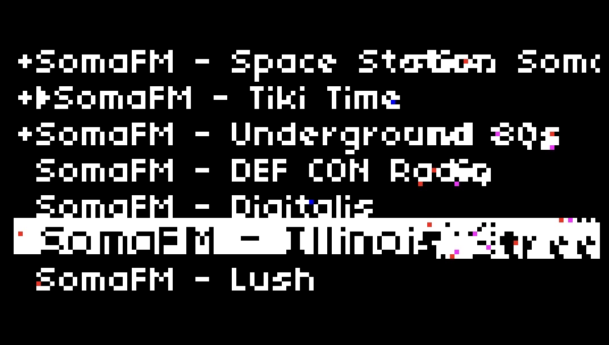

# this is a work in progress!
- play internet raido streams from your norns
- a great use for norns when you're not actively making music on it
- also a test of github copilot
- inspired by @mlogger 's idea in https://llllllll.co/t/norns-ideas/17625/1328

- **requires internet connection (wifi or ethernet) and [mpv](https://mpv.io/) to be installed (not installed by default)**
    - **to check for/install mpv:**
        - from maiden `os.execute('sudo apt install mpv')`
      - **OR**
        - ssh into norns `ssh we@norns.local`
        - run `sudo apt install mpv`

# currently:
### main controls:
- e2 scrolls through list
- e3 favorites/unfavorites streams
- k3 plays selected stream (also stops previously playing stream before playing a new stream)
- k2 stops playback

### params menu:
- exit option (close - kill mpv and close script if another script is selected, open - leave mpv running to run through effects scripts, etc) default = close
- edit stream name
- edit stream url
- add stream (see "add your own streams" below)

# add your own streams:
### method one (recommended):
- direct your browser of choice to maiden (yournornsip/maiden)
- go to `/code/internet-radio/streams.lua` file
- follow the format:
`{name = "stream name", address = "streamurl"},`

### method two:
- go to the params page
- use a usb keyboard(recommended) or e2 and e3 to enter the stream info in this format:
`stream name, https://yourstreamurlusuallyendingin-mp3`

# supported stream formats:
- MP3
- AAC
- Ogg Vorbis
- WMA
- RealAudio
- FLAC
- And maybe more. MPV uses ffmpeg to decode everything, so any streaming format that ffmpeg [supports](http://ffmpeg.org/general.html#Supported-File-Formats_002c-Codecs-or-Features) should work. 

# to-do:
- [ ] move streams.lua to /code/internet-radio/lib folder
- [ ] more diverse default streams
- [ ] add tips on finding streams / links to stream lists?
- [ ] proper screenshot (see [monome screenshot notes](https://monome.org/docs/norns/help/data/#png))
- [ ] add to [norns.community](https://github.com/monome-community/norns-community) when v1.0.0 is ready
- [ ] think about community stream list
- [x] add supported stream format details to README and streams.lua
- [x] link to mpv docs in README
- [x] add grey now-playing highlight
- [x] state saving functionality (retains exit option and if set to open, updates screen to reflect currently playing stream)
- [x] add default exit parameter option (close - kill mpv on new script load, or open - allow to keep playing and use as input for other scripts)
- [x] update version in script header
- [x] change order of maiden and ssh instruction in readme
- [x] way to favorite streams / bump to top of list
- [x] delete current stream option in params
- [x] update streams.lua documentation comments
- [x] verify add script from params page works (:
- [x] change scroll from e3 to e2
- [x] change streams.txt to streams.lua - easier to hide and add streams
- [x] radio as script / tape input (https://llllllll.co/t/norns-ideas/17625/1332) ty @infinitedigits as always (:
    - without doing this: mpv runs as a separate process(doesn't register in norns mixer or get recorded to tape)
    - doing this means you have to use 'monitor' mix to listen to radio as an input source - but I might have a way around this.. (simple in -> out engine, or leverage softcut somehow?)
      - have decided against doing this for now.
    - makes sense since radio is not an engine, but a process that you're running on device.  
- [x] modify / rename option in params
- [x] keyboard/encoder input to add streams