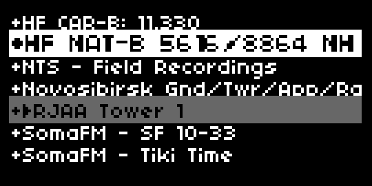

# stream internet radio from norns
> inspired by @mlogger 's idea from the lines thread - ["norns ideas"](https://llllllll.co/t/norns-ideas/17625/1328)

### * visit [llllllll.com/internet-radio](https://llllllll.co/t/internet-radio/66152) - for discussion, ideas, and help  

---
- requires internet connection and **[mpv](https://mpv.io/) - _not installed by default_**
 
- **to install this script, enter the following into maiden:**
  - `;install https://github.com/tapecanvas/internet-radio`

- **to install mpv on your norns _(required)_, use one of the methods below:**
 
    - install mpv from **maiden:**
        - in maiden,
          - run `os.execute('sudo apt update')` before installing mpv (refreshes package list) - no need to upgrade
          - then enter `os.execute('sudo apt install mpv')`
          - enter 'Y' when prompted and then hit 'enter' to continue the installation
          - will take a minute or so to install
          - if successful, you should see something like `true exit 0` and `<ok>` in the matron window in maiden
    - **or** install mpv over **ssh**
        - ssh into norns `ssh we@norns.local`
        - run `sudo apt update` to refresh package list
        - run `sudo apt install mpv`
        - press `enter` when asked if you want to continue with install
        - wait for the install to complete (will return to prompt after successful install)

- *the order that you install internet-radio and mpv does not matter
- **_restart your norns after both internet-radio and mpv have been installed_**

# controls:
- if you aren't hearing anything, make sure your monitor and input volumes in norns mixer are turned up!
### main controls:
- **e2 -** scrolls through list of streams
- **e3 -** favorites/unfavorites a stream
- **k3 -** plays stream
- **k2 -** stops playback

### params menu:
- **stream list -** choose a file containing a list of links to internet streams
- **exit option -** how should mpv behave when you select another script?
  - **close (default)** - kill mpv if another script is selected
  - **open** - leave mpv running to run through effects scripts, etc


# add your own streams:
> **DO NOT edit /code/internet-radio/lib/ files!** This folder only exists to easily package/update the default stream lists with the script **_changes made to it will prevent updating the script from Maiden_**
1. direct your browser of choice to **maiden** (http://norns.local/maiden/ **or** yournornsip/maiden)
2. go to the `/data/internet-radio/streams/` directory in the left side pane
3. copy and rename template.lua or create your own `filename.lua` list 
4. follow the format:
``` lua
return {
{name = "stream name", address = "streamurl"},
{name = "stream name", address = "streamurl"},
}
```

# supported stream formats:
- MPV uses ffmpeg to decode everything, so any streaming format that ffmpeg [supports](http://ffmpeg.org/general.html#Supported-File-Formats_002c-Codecs-or-Features) should work. 
  > you will mainly see .m3u .mp3 and .pls streams 

# stream sources:
- [Live ATC - air traffic control streams](https://www.liveatc.net/feedindex.php)
- [SomaFM](https://somafm.com/listen/)
- [NTS](https://www.nts.live) + a little dev tools snooping
- [radio aporee](https://radio.aporee.org)
- [radio-browser](https://www.radio-browser.info/tags)  - lil bit of everything
- [demoscene and video game music stream links](https://mw.rat.bz/davgmsrl/)
- [all BBC streams](https://garfnet.org.uk/download/radio/20231029-bbc-radio-norewind.m3u.txt)
- [eclectic streams](https://garfnet.org.uk/download/radio/20231029-internet-radio.m3u.txt)
- [github.com/mikepierce/internet-radio-streams](https://github.com/mikepierce/internet-radio-streams)
- [streamfinder.com](https://www.streamfinder.com)
- [github.com/junguler/m3u-radio-music-playlists](https://github.com/junguler/m3u-radio-music-playlists)
- [github.com/mcplayer9999/radio-garden-m3u](https://github.com/mcplayer9999/radio-garden-m3u)
- [gist.github.com/spence-man/internet-radio-streams](https://gist.github.com/spence-man/1c37a339d2c5e3aa5b90f7c72b5a39d1)
- [internet-radio.com](https://www.internet-radio.com)
- [Broadcastify - emergency, rail, and aviation feeds](https://www.broadcastify.com/listen/) - these usually have annoying ads when you first tune in..
- and countless others if you're interesting in hunting for them 


# community streams:
- if you make a custom list of streams that you want to share, submit a pull request to this repo and I will include it in the project for others to use!


# to-do:
- [ ] beta test phase (currently)
- [ ] look into radio garden api
- [ ] pitch/speed param? https://mpv.io/manual/master/#audio-filters
- [ ] demo video
- [ ] add to [norns.community](https://github.com/monome-community/norns-community) when v1.0.0 is ready

---
## archive:
- [x] fix favorite state saving bug
  - favorites get overwritten (should have seen this coming..) - also causes playing index to be off by num of favorites when reopen app if exit_option is open 
- [x] revert /lib streams overwriting /data stream files
  - this will require a slightly different approach to pushing out new stream lists, but that's worth having more stability and better saving of user changes
- [x] remove params (add, edit, delete) - these were kind of redundant and would cause problems since default streams overwrite user changes 
- [x] move /data/internet-radio/streams to prevent "local changes" preventing script updates
- [x] figure out update [issue](https://github.com/tapecanvas/internet-radio/issues/3) again
- [x] figure out update [issue](https://github.com/tapecanvas/internet-radio/issues/3)
- [x] add lines link to script header and readme
- [x] add BBC streams to /lib
- [x] rename and modify /lib/default.lua (make a template file) and update streams.lua
- [x] clean up code / comment / streams list (rename/remove default.lua)
- [x] clean up readme
- [x] update readme again
- [x] update script header controls
- [x] test everything thoroughly
  - [x] state saving, adding streams in all manners, stream edits, etc
  - [x] test install steps / use on other norns shields
  - exerything worked as expected on my a 2nd shield (mpv install and all current features)
- [x] fix: moving from one stream list to another while a stream is playing result in the play icon showing up in same index on new list but that index is not playing
- [x] think about community stream lists
- [x] add stream list select parameter to choose a file containing streams to use
- [x] MAJOR problem: comment hidden streams get removed from streams.lua after sort
  - DO NOT TRY to temporarily hide a stream from your station list by removing it from this steams.lua - it will be deleted from the table
- [x] add tips on finding streams / links to stream lists?
- [x] proper screenshot (see [monome screenshot notes](https://monome.org/docs/norns/help/data/#png))
- [x] more diverse default streams
- [x] fix playing highlight issue when re-loading after close
- [x] move streams.lua to /code/internet-radio/lib folder
- [x] add supported stream format details to README and streams.lua
- [x] link to mpv docs in README
- [x] add grey now-playing highlight
- [x] state saving functionality (retains exit option and if set to open, updates screen to reflect currently playing stream)
- [x] add default exit parameter option (close - kill mpv on new script load, or open - allow to keep playing and use as input for other scripts)
- [x] update version in script header
- [x] change order of maiden and ssh instruction in readme
- [x] way to favorite streams / bump to top of list
- [x] delete current stream option in params
- [x] update streams.lua documentation comments
- [x] verify add script from params page works (:
- [x] change scroll from e3 to e2
- [x] change streams.txt to streams.lua - easier to hide and add streams
- [x] radio as script / tape input (https://llllllll.co/t/norns-ideas/17625/1332) ty @infinitedigits as always (:
    - without doing this: mpv runs as a separate process(doesn't register in norns mixer or get recorded to tape)
    - doing this means you have to use 'monitor' mix to listen to radio as an input source - but I might have a way around this.. (simple in -> out engine, or leverage softcut somehow?)
      - have decided against doing this for now.
    - makes sense since radio is not an engine, but a process that you're running on device.  
- [x] modify / rename option in params
- [x] keyboard/encoder input to add streams
